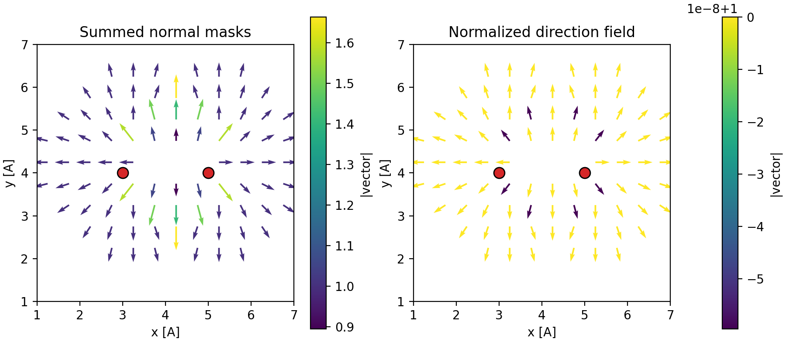

Concepts
========

AtomVoxelizer stores atom-centered information on a periodic 3D grid. The core
object is ``VoxelGrid``: it holds a simulation cell, a grid shape, and a NumPy
array of voxel values. You can choose the grid by target real-space
``resolution`` or by explicit ``gpts``.

How Sphere Painting Works
-------------------------

Most operations paint a sphere around each atom:

1. Convert an atom position to fractional coordinates and wrap it into the
   primary periodic cell.
2. Convert that position to a voxel index.
3. Reuse a cached list of integer voxel offsets inside the requested radius.
4. Add those offsets to the atom-center voxel and wrap by the grid shape.
5. Modify only the selected local voxels.

This avoids the expensive alternative of scanning every voxel against every
atom. A direct distance scan is typically ``O(N_atoms * N_voxels)``.
AtomVoxelizer instead loops over atoms and visits only the local stencil around
each atom. For fixed radius and resolution, that stencil size is roughly
constant, so sphere painting scales approximately as ``O(N_atoms)``.

Sphere Operations And Masks
---------------------------

The scalar grid API uses explicit operations:

``set_sphere`` / ``set_spheres``
   Write values into a sphere.

``add_sphere`` / ``add_spheres``
   Add values into a sphere. This is useful for shell-overlap or coordination
   masks.

``mul_sphere`` / ``div_sphere``
   Multiply or divide selected voxels.

``min_sphere`` / ``min_spheres``
   Keep the minimum of the existing grid value and the mask value. This is
   commonly used with ``mask="distance"`` to build nearest-atom distance
   fields.

Two scalar mask types are available:

``constant``
   Every voxel in the sphere receives the supplied value or factor.

``distance``
   Every voxel receives its real-space distance from the sphere center. The
   distance is in Angstrom when the cell is in Angstrom.

Grid Values And Dtypes
----------------------

The default grid dtype is ``numpy.float32``. Pass ``dtype=...`` when another
numeric storage type is useful:

.. code-block:: python

   grid = VoxelGrid(cell, resolution=0.25, dtype=np.int16)

Integer dtypes are useful for count-like masks. Floating dtypes are appropriate
for distance fields and analysis workflows. Complex dtypes support arithmetic
sphere operations, but ordered operations such as ``min_sphere``,
``clamp_grid``, and value-range sampling are not defined for complex grids.

Backends
--------

``VoxelGrid`` is the default NumPy backend and is always available.
``VoxelGridNumPy`` is an alias for callers that want an explicit backend name.

``VoxelGridNumba`` uses Numba-compiled loops for the hot sphere-painting
operations. It is usually the fastest CPU backend for repeated sphere updates.
Install Numba directly when you want this backend:

.. code-block:: bash

   pip install numba

``VoxelGridCuPy`` stores the grid on a CUDA device with CuPy. It can be useful
for large GPU-resident workflows, but small atom-by-atom updates may be slower
than CPU backends because of data movement and kernel-launch overhead. Install
the CuPy package matching your CUDA runtime, for example:

.. code-block:: bash

   pip install cupy-cuda12x

``VoxelGridTaichi`` and ``VoxelGridTaichiGPU`` are experimental Taichi CPU/GPU
backends. They are included for experimentation, but the current CPU Taichi
backend is not expected to outperform NumPy or Numba for small sphere-update
workloads:

.. code-block:: bash

   pip install taichi

Run backend benchmarks with:

.. code-block:: bash

   python benchmarks/benchmark_backends.py --workload zeolite --backends numpy numba taichi
   python benchmarks/benchmark_backends.py --zeolite-scaling --framework BEA --resolution 0.5 --plot zeolite_scaling.png

Field Voxel Grids
-----------------

``FieldVoxelGrid`` stores scalar, vector, or matrix-valued data at each voxel.
Its array shape is ``(*gpts, *value_shape)``. ``VectorVoxelGrid`` is a
convenience alias for ``value_shape=(3,)``.

.. code-block:: python

   from atomvoxelizer import FieldVoxelGrid, VectorVoxelGrid

   scalar = FieldVoxelGrid(cell, resolution=0.25, value_shape=())
   vector = VectorVoxelGrid(cell, resolution=0.25)
   matrix = FieldVoxelGrid(cell, resolution=0.25, value_shape=(3, 3))

For vector fields, ``mask="normal"`` writes a unit vector pointing away from
the atom-center voxel. Summing normal masks over atoms and then normalizing the
nonzero vectors gives a local direction field near a surface:

.. code-block:: python

   grid = VectorVoxelGrid(cell, resolution=0.25)
   grid.add_spheres(atom_positions, radii, mask="normal")
   grid.normalize_vectors()

Vector fields can be inspected with Matplotlib:

.. code-block:: python

   grid.plot_quiver_slice(axis="z", index=grid.gpts[2] // 2, stride=2)
   grid.plot_quiver_3D(stride=3, min_norm=0.1, length=0.5)

Periodic Surfaces
-----------------

``VoxelGridAnalysis.mesh_at_value`` traces scalar-field surfaces with marching
cubes. For periodic grids, AtomVoxelizer tiles the field, keeps triangles
associated with the central periodic image, and clips boundary-crossing
triangles to the primary cell. Clipping avoids long triangles that would appear
if vertices were simply wrapped back into the cell.

For binary masks, ``surface_area_voxel_faces`` counts selected/unselected voxel
face boundaries directly. It is much faster for fine convergence scans, but it
returns a grid-aligned surface estimate rather than a smoothed triangular mesh.

Dtype Benchmark Note
--------------------

On an AMD EPYC 7551P CPU with Python 3.12.12 and NumPy 2.4.1, a small BEA
zeolite dtype benchmark at ``--resolution 0.5 --repeats 2`` showed little NumPy
wall-time sensitivity to dtype. Memory use changed predictably with item size.
Larger grids and memory-bound workloads may show stronger dtype effects.

Run the dtype benchmark with:

.. code-block:: bash

   python benchmarks/benchmark_dtypes.py --backend numpy
   python benchmarks/benchmark_dtypes.py --backend numba
