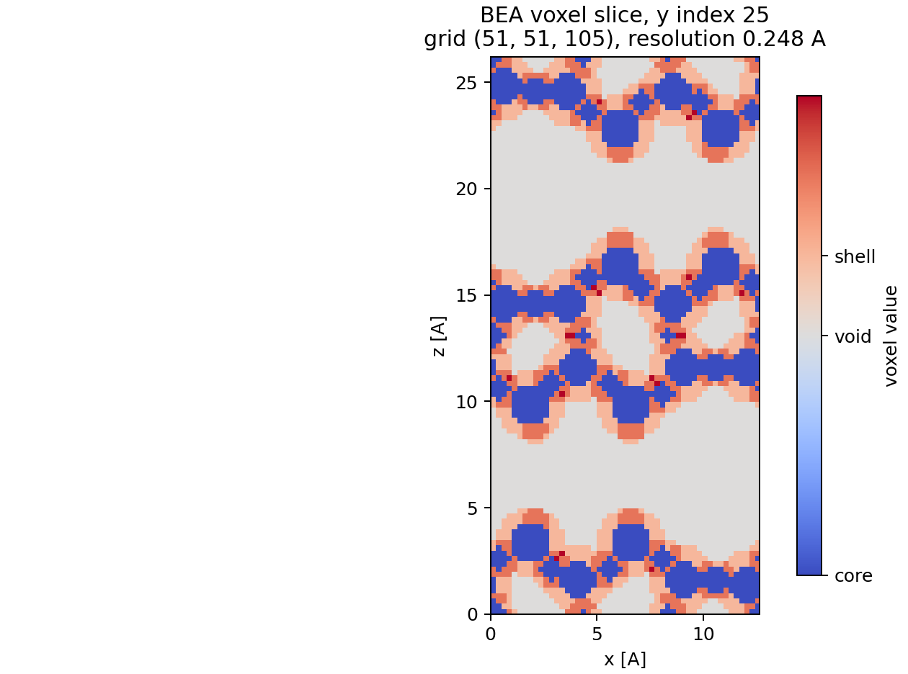
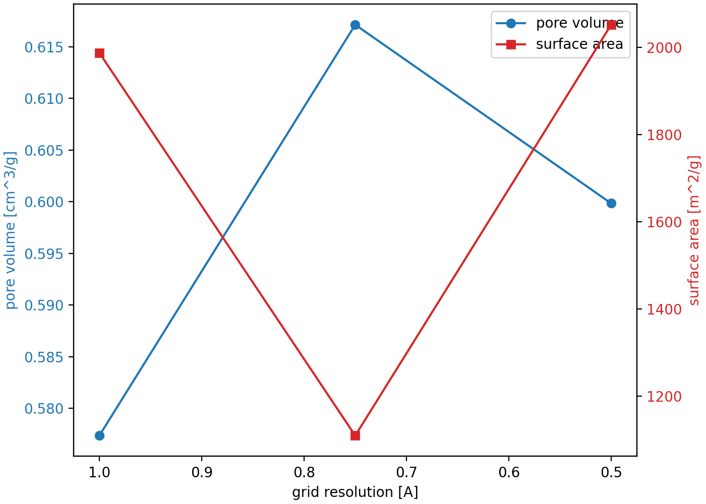
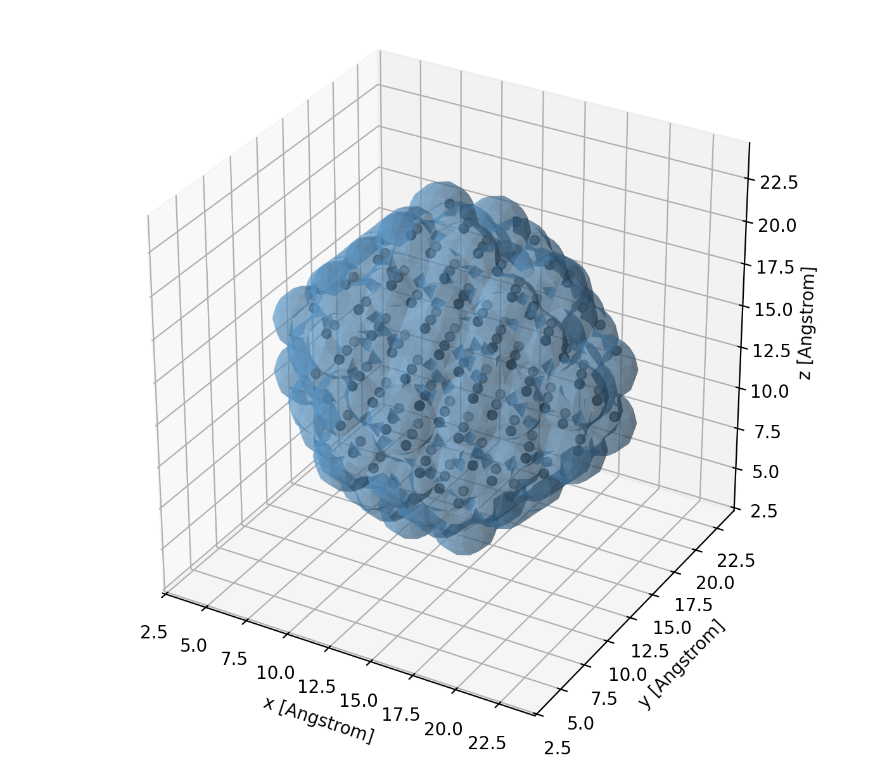
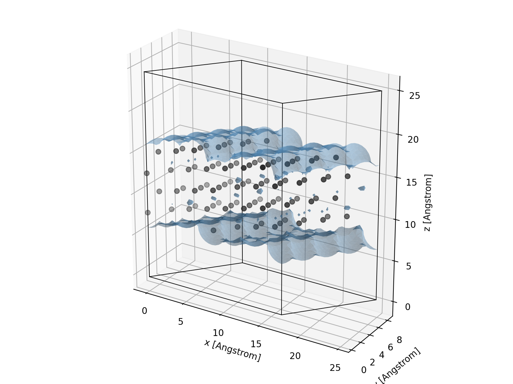
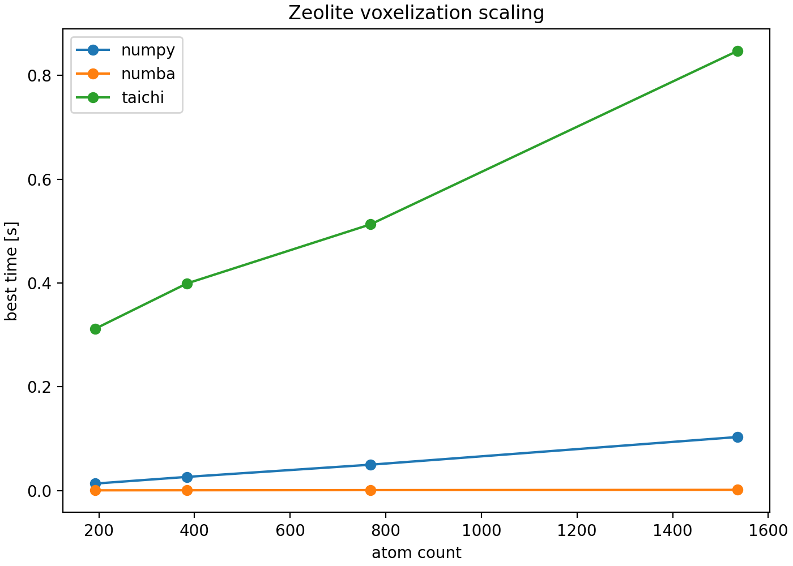

Examples
========

The example scripts live in the repository under ``examples/``. Install the
example and analysis dependencies before running them:

.. code-block:: bash

   pip install "AtomVoxelizer[examples,analysis]"

For development from source:

.. code-block:: bash

   git clone https://gitlab.com/tgmaxson/atomvoxelizer.git
   cd atomvoxelizer
   pip install -e ".[dev,examples]"

Zeolite Voxelization
--------------------

``examples/zeolite/zeolite_voxel.py`` reads a framework CIF with ASE,
voxelizes covalent-radius shells and cores, plots slices, and benchmarks
supercell scaling:

.. code-block:: bash

   python examples/zeolite/zeolite_voxel.py BEA

For a single documentation-style slice through the framework grid:

.. code-block:: bash

   python examples/zeolite/zeolite_slice_visual.py --framework BEA \
       --resolution 0.25 --output docs/source/_static/zeolite_voxel_slice.png

Zeolite Geometric Pore Analysis
-------------------------------

``examples/zeolite/zeolite_analysis.py`` estimates geometric pore volume and
geometric internal surface area from the inverse of a framework-core mask:

.. code-block:: bash

   python examples/zeolite/zeolite_analysis.py BEA --resolution 0.25

The result is a geometric voxel estimate. It is not a probe-accessible BET
surface area and is not corrected for a finite adsorbate or solvent probe. Probe
methods may be added in the future in the spirit of established porosity tools
such as `Zeo++ <https://www.zeoplusplus.org/>`_ and
`PoreBlazer <https://github.com/SarkisovGroup/PoreBlazer>`_.

The convergence command below samples resolutions from 1.00 to 0.05 Angstrom in
0.05 Angstrom increments. The example uses the fast ``voxel-faces`` surface
estimator by default; pass ``--surface-method marching-cubes`` for a smoother
triangulated estimate on smaller grids.

.. code-block:: bash

   python examples/zeolite/zeolite_analysis.py BEA --convergence \
       1.00 0.95 0.90 0.85 0.80 0.75 0.70 0.65 0.60 0.55 \
       0.50 0.45 0.40 0.35 0.30 0.25 0.20 0.15 0.10 0.05 \
       --plot bea_convergence.png

Probe Pore Volume
-----------------

``VoxelGridAnalysis.analyze_probe_accessibility`` estimates probe-center
accessible volume from a user-supplied grid, atomic positions, radii, and probe
radius. ``probe_accessible_surface_area`` estimates sampled accessible surface
area from inflated atom surfaces.

See :doc:`analysis` for the method and a BEA comparison against PoreBlazer,
including the PoreBlazer input files, matched AtomVoxelizer setup, timing, and
agreement for probe-accessible volume and surface area.

Finite Wulff Distance Surface
-----------------------------

``examples/wulff/distance_surface.py`` builds a Wulff nanoparticle, computes a
nearest-atom distance field, and exports a marching-cubes mesh at a requested
distance:

.. code-block:: bash

   python examples/wulff/distance_surface.py --symbol Pt --size 147 \
       --distance 2.0 --output pt_surface.npz
   python examples/wulff/distance_surface.py --symbol Pt --size 147 \
       --distance 2.0 --show

Periodic Pt(211) Distance Surface
---------------------------------

``examples/surfaces/pt211_distance_surface.py`` applies the same distance-field
workflow to a periodic stepped Pt(211) slab:

.. code-block:: bash

   python examples/surfaces/pt211_distance_surface.py --distance 1.8 --show

Voxel-Guided CO MCMD
--------------------

``examples/mc/orb_v3_co_mcmd.py`` builds a small cube-like WulffPack
nanoparticle, constructs a coordination-surface voxel mask, samples adsorption
sites, and runs CO adsorption/desorption MCMD. The default calculator is the
conservative ORB-V3 20-neighbor model on CPU. ASE EMT is available with
``--calculator emt`` for quick control-flow checks.

.. code-block:: bash

   python examples/mc/orb_v3_co_mcmd.py --natoms 55 --steps 100 \
       --calculator orb-v3 --device cpu --orb-neighbors 20 \
       --temperature 500 --target-coverage 0.5 --md-steps 50

By default the script writes ``examples/mc/orb_v3_co_mcmd.traj`` for viewing
the MCMD path with ASE.

The step-by-step explanation is in :doc:`quickstart`.

Benchmarks
----------

Run the backend benchmark with:

.. code-block:: bash

   python benchmarks/benchmark_backends.py --backends numpy numba taichi cupy
   python benchmarks/benchmark_backends.py --zeolite-scaling --framework BEA \
       --resolution 0.5 --plot zeolite_scaling.png

Run the dtype benchmark to compare grid storage types:

.. code-block:: bash

   python benchmarks/benchmark_dtypes.py --backend numpy
   python benchmarks/benchmark_dtypes.py --backend numba

