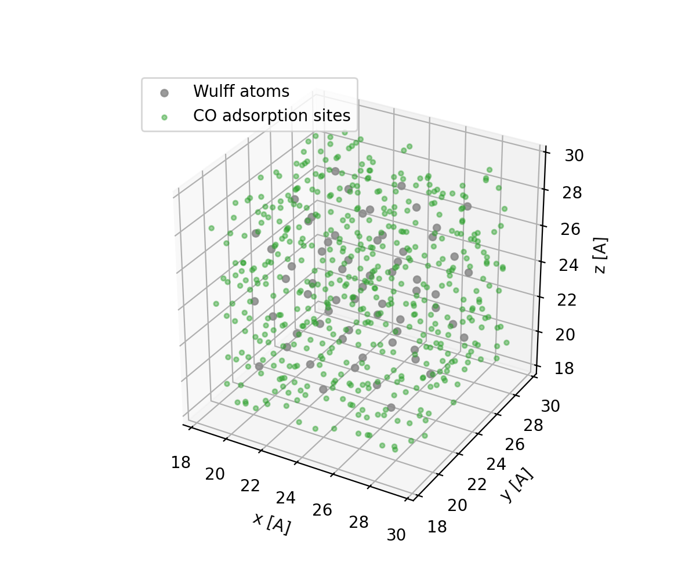
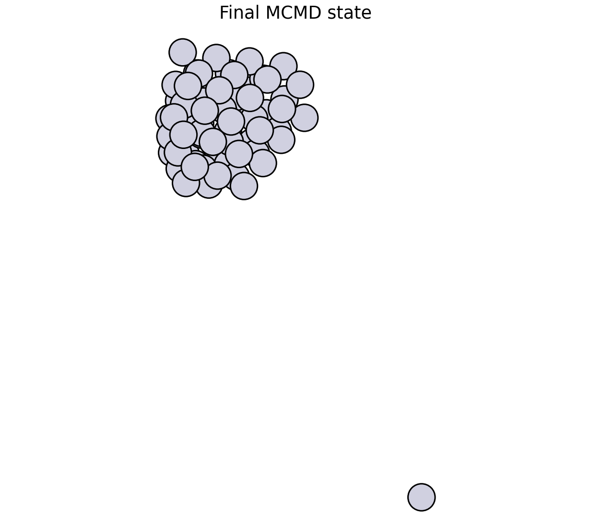

Quickstart Tutorial
===================

This tutorial builds a small cube-like WulffPack nanoparticle, converts it into
a voxel coordination-surface mask, samples adsorption sites from that mask, and
runs a simple CO adsorption/desorption MCMD loop. The runnable example defaults
to ORB-V3 on CPU with the conservative infinite-neighbor model. ASE EMT is kept
as a fast fallback for testing the mechanics of the workflow.

The complete script is available at
``examples/mc/orb_v3_co_mcmd.py``.

Install Tutorial Dependencies
-----------------------------

AtomVoxelizer provides the grid machinery. This tutorial also uses ASE and
WulffPack to build the nanoparticle:

.. code-block:: bash

   pip install AtomVoxelizer ase wulffpack

For ORB-V3 scoring, install ORB and PyTorch in the environment you use for
simulation. The example keeps that import optional because loading ORB can
download weights and initialize accelerator libraries.

Build A Cube-Like WulffPack Nanoparticle
----------------------------------------

WulffPack creates a finite fcc particle from relative surface energies. The
``natoms`` argument is a target; the final atom count can differ because the
particle is built from symmetry-compatible atomic shells.

.. code-block:: python

   from ase.build import bulk
   from wulffpack import SingleCrystal

   primitive = bulk("Pt", "fcc", a=3.92)
   surface_energies = {(1, 0, 0): 1.0}
   particle = SingleCrystal(surface_energies, primitive_structure=primitive, natoms=201)
   atoms = particle.atoms

Using only the ``(100)`` facet creates a deliberately cube-like starting point
with roughly 50 Pt atoms by default. That keeps the ORB-V3 CPU example small
enough to run while still exposing several adsorption sites.

WulffPack returns a finite cluster without a periodic simulation cell. A voxel
grid needs an invertible cell, so the example translates the cluster into a
padded cubic cell:

.. code-block:: python

   import numpy as np

   padding = 20.0
   positions = atoms.positions
   span = positions.max(axis=0) - positions.min(axis=0)
   cell_length = span.max() + 2.0 * padding
   atoms.positions = positions - positions.min(axis=0) + padding
   atoms.set_cell(np.eye(3) * cell_length)

The padding should be large enough that desorbed or weakly bound CO molecules
do not immediately interact with the opposite side of the finite simulation
cell. The example defaults to ``20.0`` Angstrom.

Before adsorption/desorption begins, the example optimizes the clean
nanoparticle. This optimized structure is then used to build the first voxel
surface mask.

Build The Voxel Surface Mask
----------------------------

The coordination-surface mask is built with two sphere passes:

1. Add a larger sphere around every atom. This gives each voxel a count of how
   many atom-centered shells overlap it.
2. Set a smaller sphere around every atom back to zero. This removes atomic
   cores from the trial region.

.. code-block:: python

   import numpy as np
   from ase.data import covalent_radii
   from atomvoxelizer import VoxelGrid

   radii = covalent_radii[atoms.numbers]
   grid = VoxelGrid(atoms.cell.array, resolution=0.35, dtype=np.float32)
   grid.add_spheres(atoms.positions, 1.4 * radii, value=1.0)
   grid.set_spheres(atoms.positions, 1.1 * radii, value=0.0)

This is the same stencil-based operation described in
:doc:`concepts`. AtomVoxelizer visits the local sphere stencil around each
atom instead of scanning every grid point against every atom.

Sample Trial Sites
------------------

For a surface trial region, sample all non-core shell voxels. This includes
atop, bridge, hollow, edge, and corner-like environments instead of restricting
CO to one voxel-count range.

.. code-block:: python

   trial_sites = []
   for position in grid.sample_voxels_in_range(0.5, 100.0, min_dist=0.6, seed=7):
       trial_sites.append(np.asarray(position))
       if len(trial_sites) >= 500:
           break
   trial_sites = np.array(trial_sites)

Those positions are voxel centers in real space. In the MCMD example they are
candidate carbon positions for CO adsorption. Occupied sites are assigned by
the nearest adsorbed carbon within a short cutoff.

Minimal MCMD Loop
-----------------

The example uses a simple grand-canonical score for CO:
``E - mu_CO * N_CO``. An adsorption trial adds one CO molecule with carbon at an
empty voxel-sampled surface site and oxygen pointing away from the nanoparticle
center. The newly inserted CO is optimized while the nanoparticle is fixed. A
desorption trial removes one occupied CO molecule. The trial is accepted with a
Metropolis criterion, then a short Langevin MD segment is run after every
decision. Rejected trials restore the previous accepted structure before the MD
segment. The voxel grid is rebuilt from the current nanoparticle geometry each
cycle, excluding CO atoms, so adsorption proposals follow nanoparticle motion.
Existing CO molecules block nearby proposed sites through ``--site-block-radius``.

After each step, the CO chemical potential is nudged toward the requested
coverage target. Coverage is counted as ``N_CO / N_surface_atoms``, where
surface atoms are nanoparticle atoms with coordination number below 11 by
default. Adsorption is capped by ``--max-coverage`` times this same surface
atom count, so the sampled voxel-site count controls where CO can be placed but
does not allow unbounded multilayer growth. The adaptive chemical potential is
also clamped by ``--mu-min`` and ``--mu-max`` to keep short tutorial runs from
overshooting badly.

.. code-block:: python

   import math

   beta = 1.0 / (8.617333262145e-5 * temperature)
   old_score = old_energy - mu_co * old_n_co
   trial_score = trial_energy - mu_co * trial_n_co
   delta = trial_score - old_score
   accept = delta <= 0.0 or rng.random() < math.exp(-beta * delta)

   if accept:
       atoms = trial
   else:
       atoms = old_atoms

   # The full example runs this after accepted and rejected MC decisions.
   run_langevin_md(atoms, calculator, steps=50, temperature=temperature)

Run The Example
---------------

Run a short ORB-V3 CPU MCMD example with:

.. code-block:: bash

   python examples/mc/orb_v3_co_mcmd.py --natoms 55 --steps 100 \
       --calculator orb-v3 --device cpu --orb-model-size inf \
       --temperature 500 --target-coverage 0.5 --md-steps 50 \
       --quickstart-figures

To regenerate the same documentation figures on a GPU, change ``--device cpu``
to ``--device cuda``.

For a quick mechanics check without ORB, pass ``--calculator emt --steps 5
--md-steps 1``. EMT is not intended to be a chemically meaningful CO/Pt model
here; it is just useful for checking the control flow.

The script prints the accepted move count, acceptance ratio, CO count, current
coverage, current CO chemical potential, and substrate displacement. It also
writes an ASE trajectory by default:

.. code-block:: text

   examples/mc/orb_v3_co_mcmd.traj

The image below shows the final nanoparticle state from the MCMD run.

Open it with ASE to inspect the MC path:

.. code-block:: bash

   ase gui examples/mc/orb_v3_co_mcmd.traj

Each frame is the accepted structure after one MC decision and the following MD
segment. Rejected MC trials do not appear as trial geometries; the restored
accepted structure is propagated by MD and written instead. Pass
``--trajectory ""`` to skip writing frames, or ``--trajectory path/to/file.traj``
to choose a different output path.
