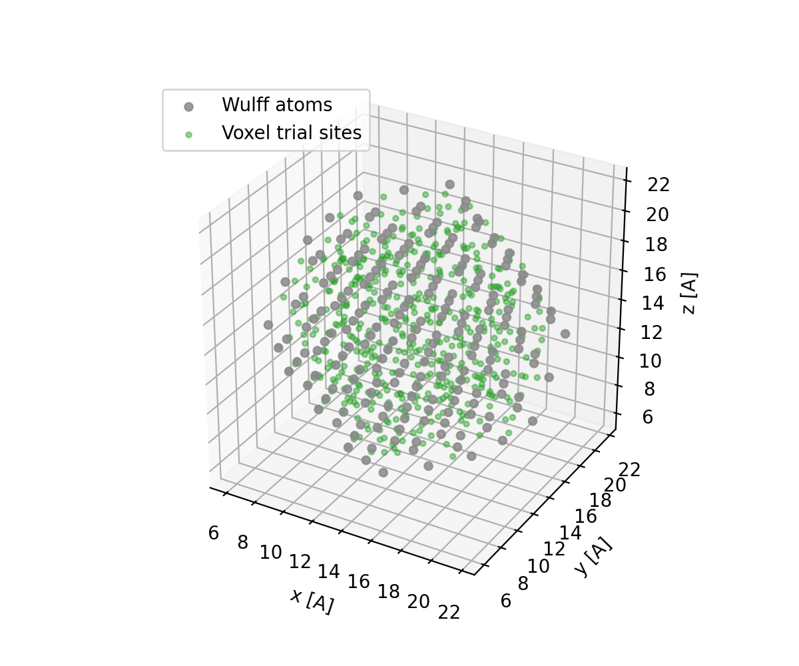
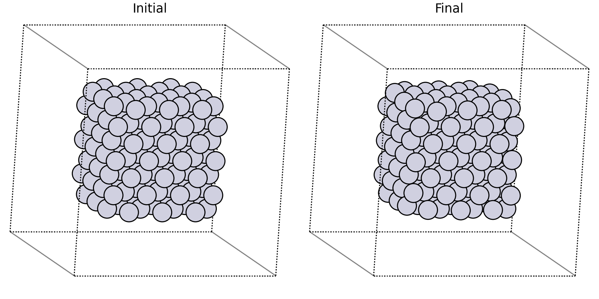

Quickstart Tutorial
===================

This tutorial builds a cube-like WulffPack nanoparticle, converts it into a
voxel coordination-surface mask, samples trial positions from that mask, and
runs a minimal Monte Carlo loop. The default example uses ASE EMT as a small,
local potential-energy scorer. ORB-V3 can be selected when the optional ORB
dependencies are installed.

The complete script is available at
``examples/mc/orb_v3_wulff_mc.py``.

Install Tutorial Dependencies
-----------------------------

AtomVoxelizer provides the grid machinery. This tutorial also uses ASE and
WulffPack to build the nanoparticle:

.. code-block:: bash

   pip install AtomVoxelizer ase wulffpack

For ORB-V3 scoring, install ORB and PyTorch in the environment you use for
simulation. The example keeps that import optional because loading ORB can
download weights and initialize accelerator libraries.

Build A Cube-Like WulffPack Nanoparticle
----------------------------------------

WulffPack creates a finite fcc particle from relative surface energies. The
``natoms`` argument is a target; the final atom count can differ because the
particle is built from symmetry-compatible atomic shells.

.. code-block:: python

   from ase.build import bulk
   from wulffpack import SingleCrystal

   primitive = bulk("Pt", "fcc", a=3.92)
   surface_energies = {(1, 0, 0): 1.0}
   particle = SingleCrystal(surface_energies, primitive_structure=primitive, natoms=201)
   atoms = particle.atoms

Using only the ``(100)`` facet creates a deliberately cube-like starting point.
That makes the MC demonstration visible: accepted moves can reduce the
spread in atom distances from the nanoparticle center.

WulffPack returns a finite cluster without a periodic simulation cell. A voxel
grid needs an invertible cell, so the example translates the cluster into a
padded cubic cell:

.. code-block:: python

   import numpy as np

   padding = 6.0
   positions = atoms.positions
   span = positions.max(axis=0) - positions.min(axis=0)
   cell_length = span.max() + 2.0 * padding
   atoms.positions = positions - positions.min(axis=0) + padding
   atoms.set_cell(np.eye(3) * cell_length)

The padding should be larger than the largest mask radius so periodic wrapping
does not make opposite sides of the finite particle interact.

Build The Voxel Surface Mask
----------------------------

The coordination-surface mask is built with two sphere passes:

1. Add a larger sphere around every atom. This gives each voxel a count of how
   many atom-centered shells overlap it.
2. Set a smaller sphere around every atom back to zero. This removes atomic
   cores from the trial region.

.. code-block:: python

   import numpy as np
   from ase.data import covalent_radii
   from atomvoxelizer import VoxelGrid

   radii = covalent_radii[atoms.numbers]
   grid = VoxelGrid(atoms.cell.array, resolution=0.35, dtype=np.float32)
   grid.add_spheres(atoms.positions, 1.4 * radii, value=1.0)
   grid.set_spheres(atoms.positions, 1.1 * radii, value=0.0)

This is the same stencil-based operation described in
:doc:`concepts`. AtomVoxelizer visits the local sphere stencil around each
atom instead of scanning every grid point against every atom.

Sample Trial Sites
------------------

For a surface trial region, sample voxels with values near three. The range
``2.5`` to ``3.5`` avoids depending on exact floating-point equality after
repeated additions.

.. code-block:: python

   trial_sites = []
   for position in grid.sample_voxels_in_range(2.5, 3.5, min_dist=0.6, seed=7):
       trial_sites.append(np.asarray(position))
       if len(trial_sites) >= 500:
           break
   trial_sites = np.array(trial_sites)

Those positions are voxel centers in real space. They are useful as trial
destinations or directions for Monte Carlo moves near the nanoparticle surface.

Minimal MC Loop
---------------

The example chooses likely surface atoms by radial distance, picks a sampled
voxel trial site, and moves the atom a short distance toward that site. The
default score is the ASE EMT potential energy, which keeps the tutorial
physically interpretable while still running quickly. With the default
``temperature=0.2`` and ``max_displacement=0.35``, the Pt cube accepts a visible
number of trial moves without accepting every trial.

.. code-block:: python

   import math

   rng = np.random.default_rng(11)
   center = atoms.positions.mean(axis=0)
   distances = np.linalg.norm(atoms.positions - center, axis=1)
   movable = np.flatnonzero(distances >= np.quantile(distances, 0.65))

   from ase.calculators.emt import EMT

   atoms.calc = EMT()

   current_score = atoms.get_potential_energy()
   beta = 1.0 / 0.2

   atom_index = int(rng.choice(movable))
   target = trial_sites[int(rng.integers(len(trial_sites)))]
   old_position = atoms.positions[atom_index].copy()
   direction = target - old_position
   direction *= min(1.0, 0.35 / np.linalg.norm(direction))
   atoms.positions[atom_index] = old_position + direction

   trial_score = atoms.get_potential_energy()
   delta = trial_score - current_score
   accept = delta <= 0.0 or rng.random() < math.exp(-beta * delta)
   if not accept:
       atoms.positions[atom_index] = old_position

In an ORB-V3 MC workflow, the voxel part stays the same. Only the scoring
function changes: evaluate the old and trial structures with ORB-V3, then apply
the usual Metropolis criterion to the energy difference.

Run The Example
---------------

Run the EMT tutorial example with:

.. code-block:: bash

   python examples/mc/orb_v3_wulff_mc.py --natoms 201 --resolution 0.35 \
       --steps 250 --score emt --temperature 0.2 \
       --plot quickstart_wulff_mc_sites.png \
       --state-plot docs/source/_static/quickstart_wulff_mc_initial_final.png

The script prints the accepted move count, acceptance ratio, initial/final
radial variance, and mean/max displacement from the starting structure so you
can confirm that atoms actually moved during the run. It also writes an ASE
trajectory by default:

.. code-block:: text

   examples/mc/orb_v3_wulff_mc.traj

The image below was generated from a 250-step EMT run. The accepted moves lower
the radial variance from ``3.386237`` to ``3.102322`` for this deterministic
seed.

Open it with ASE to inspect the MC path:

.. code-block:: bash

   ase gui examples/mc/orb_v3_wulff_mc.traj

The first frame is the starting cube-like particle. Each following frame is the
structure after one MC step; rejected steps repeat the previous coordinates but
still carry updated ``Atoms.info`` metadata such as ``mc_accepted`` and
``mc_score``. Pass ``--trajectory ""`` to skip writing frames, or
``--trajectory path/to/file.traj`` to choose a different output path.

To try the optional ORB-V3 scorer after installing ORB and its model
dependencies:

.. code-block:: bash

   python examples/mc/orb_v3_wulff_mc.py --score orb-v3 --device cpu --steps 10

The ORB helper is intentionally isolated in the example script. ORB package
APIs, weights, and accelerator setup can change independently of the voxel-grid
workflow.
